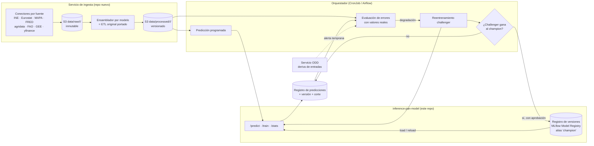

# Propuesta: actualización continua de los modelos de series temporales

**Repositorio:** `inference-pan-model` (DatagIA) · **Fecha:** 6 de octubre de 2026 · **Estado:** borrador para discusión

---

## 1. Resumen

Se quiere que los modelos de series temporales se mantengan al día solos:

- descargar periódicamente sus fuentes de datos con un scraper por modelo;
- predecir con una cadencia acorde a la fuente y al horizonte;
- vigilar si las predicciones se alejan de la realidad;
- cuando lo hagan, reentrenar con los datos nuevos y **sustituir el modelo base** por el
  reentrenado.

La propuesta organiza esto en **cuatro piezas**:

1. **Ingesta**: un servicio nuevo, fuera de este repo, con conectores reutilizables por fuente
   (INE, Eurostat, MAPA, FRED…) y un ensamblador por modelo que reproduce exactamente su ETL
   original.
2. **Predicción programada**: un orquestador llama a los endpoints que ya existen y guarda cada
   predicción con la versión del modelo y la fecha de corte de los datos.
3. **Monitorización**: cuando llega el valor real (horizonte + desfase de publicación), se calcula
   el error. La deriva de las entradas (servicio ODD) sirve de alerta temprana.
4. **Reentrenamiento y promoción *champion/challenger***: el modelo nuevo solo sustituye al base si
   le gana en un periodo de prueba común, y la sustitución es **versionada y reversible**.

**Decisión de fondo.** Hoy la regla es *"el artefacto base nunca se sobrescribe"*. Esta propuesta
no la elimina, la convierte en *"el artefacto base nunca se sobrescribe **en el sitio**: se
publica una versión nueva y se mueve un puntero"*. Así se consigue lo que se pide (el modelo
nuevo pasa a ser la base) sin perder trazabilidad ni la posibilidad de volver atrás. El
reentrenamiento que lanza un usuario con `mlflow_run_id` no cambia: sigue sin tocar la base.

**Recomendación de arranque.** Piloto con **ml17** (precio del porcino). Es el bucle más corto:
horizonte t+1, el error se conoce al mes siguiente, sus fuentes tienen API oficial y su
reentrenamiento tarda segundos y ya está verificado: reproduce la memoria a 4 decimales.

---

## 2. Alcance: qué modelos y con qué fuentes

### 2.1 Grupo A: series temporales con fuentes públicas (objetivo de los scrapers)

Los datos de esta tabla salen de los manifests (`inbox/aNN/manifest.yaml`) y del código
entregado (`inbox/aNN/codigo/`).

| Modelo | Qué predice | Frecuencia | Horizonte | Fuentes identificadas | ¿Trae adquisición en el código entregado? |
|---|---|---|---|---|---|
| **ml17** porcino | Precio porcino clase E (€/100 kg) | Mensual | t+1 | Eurostat (sacrificio, `apro_mt`), agridata UE (cereales), MAPA (precios percibidos), INE | **Sí**: `scripts/legacy/download_*.py` y `docs/official_data_sources.md` |
| **ml23** lácteo | Precio medio de la leche líquida, 16 series producto × canal | Mensual | t+6 | MAPA (panel de consumo, índices de precios percibidos), INE (IPC), FRED (HICP) | **Sí**: `src/data_processing/download_raw.py` |
| **ml21** cereal espacial | Retorno y señal del precio provincial | Mensual | H1, H2, H3 | MAPA (índices, costes pagados), FAO (índice de precios), MATIF/yfinance, EUR/USD, ERA5-Land (Google Earth Engine), IGN (provincias) | **Sí**: `src/data_processing/ingestion/*.py` |
| **ml15** fitosanitarios | IPI fitosanitario nacional | Mensual | t+6 | IPI nacional e internacional, FRED (PPI pesticidas USA), yfinance (cobre, Brent, EUR/USD), INE (IPC por CCAA), clima (Google Earth Engine) | Parcial: el manifest lista las dependencias de adquisición (`yfinance`, `earthengine-api`), pero no se han encontrado scripts. **Fuente del IPI pendiente de confirmar** |
| **ml16** materias primas cárnicas | Alerta de subida de coste (clasificación) | Mensual | t+4 | MAPA (precios), precipitación ERA5-Land (Google Earth Engine), epidemias veterinarias | Parcial: `scripts/google-earth-extraction.py`. **Fuente de epidemias pendiente de confirmar** |

**Desfase de publicación.** No todas las fuentes publican el mes al terminarlo: el manifest de
ml21 fija `MAPA_ADMIN_LAG = 3` meses. Este desfase marca cuándo puede ejecutarse cada predicción
y cuándo se conoce su error (§4).

### 2.2 Grupo B: series temporales de sensores de planta (mismo ciclo, ingesta distinta)

**ml3** (enfermedades de la viña, ventana horaria de 168 h), **ml9** (silos), **ml40**
(refrigeración), **ml43** (hornos), **ml45** (puntos críticos) y **ml46** (incrustaciones).

Sus datos no se descargan de una web: llegan de sensores de cada instalación. **No necesitan
scraper**, pero sí la monitorización, el reentrenamiento y la promoción de esta propuesta, con
dos diferencias:

- la "fuente" es el flujo IoT de la planta;
- el valor real (la etiqueta) suele ser una observación de campo o un evento registrado, no un
  dato publicado.

El origen de las series horarias de ml3 (estaciones propias o red pública tipo SIAR/AEMET) no
consta en el entregable y hay que confirmarlo: si es pública, ml3 pasaría al grupo A.

### 2.3 Fuera de alcance

- ml28, ml31 y ml33 no tienen parámetros aprendidos (ver `outputs/informe_modelos_sin_reentrenamiento.md`).
  Sí podría automatizarse la actualización de sus datos de referencia (p. ej. los precios de
  `crop_economics.json` de ml31), pero eso es mantenimiento de datos, no reentrenamiento.
- Los modelos de imagen, vídeo y audio (ml2, ml4, ml5, ml7, ml8, ml10, ml41) no son series
  temporales.

---

## 3. Arquitectura propuesta

### 3.1 Por qué la ingesta va en un servicio aparte

- **Arquitectura.** Este repo es de inferencia y cada plugin solo sabe predecir y entrenar.
  Meter los scrapers dentro rompería la separación hexagonal y mezclaría responsabilidades.
- **Dependencias y credenciales.** Los scrapers necesitan `earthengine-api` (con cuenta de
  servicio de Google), `yfinance`, lectores de Excel/ODS y claves de API (FRED). Ninguna hace
  falta para servir predicciones, y no conviene meterlas en la imagen de inferencia.
- **Reutilización.** Las mismas fuentes alimentan varios modelos: el IPC del INE lo usan ml15 y
  ml23, Google Earth Engine lo usan ml15, ml16 y ml21, y el MAPA lo usan casi todos. La unidad
  natural es **un conector por fuente**, compartido, y **un ensamblador por modelo**.
- **Ciclo de vida distinto.** Un scraper se rompe cuando la web cambia de formato, y su
  corrección no debería obligar a redesplegar el servicio de inferencia.

### 3.2 La regla más importante de la ingesta: paridad con el ETL original

El ensamblador de cada modelo debe producir **exactamente** el dataset con el que se entrenó:
mismas columnas, mismo orden, mismos *lags*, medias móviles, desfases y codificaciones. Debe
portarse del ETL entregado (p. ej. `prepare_horizon_dataset` de ml23 o
`dataset_entrenamiento_final.csv` de ml21), **no reescribirse**.

La auditoría lo demostró: un preprocesado ligeramente distinto produce predicciones erróneas que
ningún test detecta (rellenar features con 0 en ml21 o un `imgsz` distinto en ml7). Cada
ensamblador debe validarse regenerando el dataset histórico y comparándolo **celda a celda** con
el entregado antes de usarse.

### 3.3 Almacenamiento

| Ruta | Contenido | Regla |
|---|---|---|
| `s3://…/data/raw/<fuente>/<fecha_descarga>/` | Respuesta bruta de cada fuente | Inmutable. Permite re-procesar y auditar |
| `s3://…/data/processed/<modelo>/<fecha_corte>/` | Dataset del modelo, listo para predecir o entrenar | Versionado por fecha de corte. Cada versión de modelo referencia el corte con el que se entrenó |
| `s3://…/artifacts/fixed/<ARTIFACT_FOLDER_NAME>/versions/<vN>/` | Artefactos de cada versión promovida | Inmutable. Nunca se sobrescribe |

**Revisiones de datos.** INE, Eurostat y MAPA corrigen a menudo valores ya publicados. Guardar
cada descarga completa (no solo el mes nuevo) permite detectar esas revisiones y saber con qué
versión de los datos se entrenó y se predijo cada modelo.

---

## 4. Calendario: relación entre la frecuencia de la fuente y el horizonte

### 4.1 Reglas

1. **Ingesta**: al ritmo de la fuente más lenta que necesita el modelo, después de su fecha de
   publicación (no a fecha fija), y comprobando que el mes nuevo está realmente publicado.
2. **Predicción**: cuando la ingesta del modelo está completa para un nuevo periodo. No tiene
   sentido predecir más a menudo que la frecuencia de la fuente: la predicción sería la misma.
3. **Evaluación**: el error de una predicción hecha en *t* para *t + h* solo se conoce cuando se
   publica el dato real de *t + h*, es decir, **h + desfase de publicación** después.

### 4.2 Cuándo se conoce el error de cada modelo

| Modelo | Horizonte | Ingesta y predicción | El error se conoce… | Implicación |
|---|---|---|---|---|
| ml17 | t+1 | Mensual | ~1 mes después, más el desfase de Eurostat y el MAPA | Bucle corto: buen candidato a piloto |
| ml16 | t+4 | Mensual | ~4 meses después | Bucle medio |
| ml21 | H1-H3 | Mensual | 1-3 meses después, **más 3 meses de desfase del MAPA** | Bucle largo pese a horizontes cortos |
| ml15 | t+6 | Mensual | ~6 meses después | Bucle largo |
| ml23 | t+6 | Mensual | ~6 meses después | Bucle largo |

**Consecuencia.** En los modelos de horizonte largo, esperar a que el error real se degrade
significa reaccionar con medio año de retraso. Por eso la monitorización necesita **dos
señales** (§5): el error realizado, que confirma la degradación, y la deriva de las entradas,
que avisa antes.

---

## 5. Cuándo "se aleja demasiado": criterios de reentrenamiento

Para no reentrenar por ruido, los criterios son objetivos, por modelo y con histéresis.

| Señal | Qué mide | Umbral propuesto | Papel |
|---|---|---|---|
| **Error realizado** | MAE (regresión) o F1/precisión (clasificación) móvil de las últimas *N* predicciones ya evaluables | MAE móvil > **2 × MAE reportado** durante **k periodos consecutivos** (p. ej. k = 2) | **Disparador principal**. Usa la misma tolerancia que el *golden dataset* de `verification` |
| **Acierto direccional** | % de predicciones que aciertan si sube o baja | Por debajo del criterio de la memoria (p. ej. < 60 % en ml23) | Disparador complementario |
| **Deriva de entradas** | Distribución de las features nuevas frente al *baseline* de entrenamiento (servicio ODD, ya integrado) | Alerta ODD sostenida | **Alerta temprana**. Abre revisión, no reentrena por sí sola |
| **Antigüedad del modelo** | Meses desde el último corte de entrenamiento | Configurable por modelo (p. ej. 12 meses) | Red de seguridad: reentrenar aunque no haya alertas |
| **Revisión de datos históricos** | Una fuente ha corregido datos ya usados en el entrenamiento | Cambio material en el periodo de entrenamiento | Motivo para reentrenar, documentado |

Los umbrales concretos (N, k, antigüedad) son decisión de negocio por modelo (§10). Se
documentarían en un bloque `monitoring:` nuevo del manifest, junto a las métricas reportadas
que les sirven de referencia.

---

## 6. Reentrenamiento y promoción del nuevo modelo base

### 6.1 Dos caminos de entrenamiento que conviven

| | Reentrenamiento **de usuario** (existe) | Reentrenamiento **del sistema** (nuevo) |
|---|---|---|
| Quién lo lanza | Un usuario, vía `POST /train` | El orquestador, por los criterios del §5 |
| Datos | Los que aporta el usuario | El último dataset procesado de la ingesta |
| Dónde se guarda | Run de MLflow del usuario | Run de MLflow, como **challenger** |
| ¿Sustituye a la base? | **Nunca** | **Sí, si gana y se aprueba** (§6.2) |
| Cómo se usa | Pasando `mlflow_run_id` en cada petición | Pasa a ser el modelo por defecto de todas las peticiones |

### 6.2 Promoción *champion/challenger*

1. **Entrenar el challenger** con el procedimiento original ya portado en cada plugin (`train()`
   reproduce las métricas reportadas; ver `outputs/informe_cambios_modelos.md`) sobre el último
   dataset procesado.
2. **Comparar en igualdad de condiciones.** Champion y challenger se evalúan sobre el **mismo
   periodo de prueba temporal reciente**: los últimos meses, que el challenger no ha visto al
   entrenar. Comparar contra las métricas de la memoria no sirve, porque se midieron sobre otro
   periodo.
3. **Requisitos para promover:**
   - el challenger mejora al champion en la métrica principal, o como mínimo no empeora más allá
     de una tolerancia acordada;
   - no empeora en la métrica secundaria (direccional o F1);
   - pasa los *golden cases* estructurales del manifest (salidas válidas y sin NaN);
   - las entradas del periodo de prueba no tienen deriva fuera de rango.
4. **Aprobación humana** al principio (§9). Cuando haya historial de promociones correctas, puede
   automatizarse para los modelos de bucle corto.
5. **Publicar** la versión nueva en `versions/<vN>/` y **mover el alias `champion`**. Nunca se
   sobrescribe la anterior.
6. **Tras promover:**
   - regenerar el *baseline* del servicio ODD con los datos de entrenamiento nuevos (hoy se
     construye a partir de los datos de entrenamiento subidos a S3);
   - regenerar los datos de fondo de explicabilidad (SHAP);
   - actualizar `stats()` y la ficha técnica con la nueva versión y sus métricas.
7. **Rollback**: volver a apuntar `champion` a `v(N-1)`. Es inmediato porque nada se ha borrado.

### 6.3 Dónde vive "la versión base"

| Opción | Cómo funciona | A favor | En contra |
|---|---|---|---|
| **A. MLflow Model Registry** (recomendada) | Cada modelo es un *registered model*; la base es la versión con alias `champion`; S3 guarda una copia por versión | Versionado, alias, linaje (run → datos → métricas) y rollback de serie. Ya se usa MLflow para los reentrenamientos de usuario | El plugin pasa a depender de MLflow para arrancar, salvo que se mantenga la copia en S3 como respaldo. Hay que activar el Registry en el MLflow del clúster |
| B. Puntero en S3 | `artifacts/fixed/<carpeta>/current.json` apunta a `versions/<vN>/` | Sencillo, sin dependencias nuevas | Linaje y aprobaciones a mano |

Con la opción A, el plugin resolvería al arrancar *"versión `champion` del modelo X"* y la
descargaría a la carpeta local de siempre. Si MLflow no responde, usaría la última copia en S3.

---

## 7. Qué supone modificar en este repo (`inference-pan-model`)

### 7.1 Cambios transversales

| Componente | Cambio | Motivo |
|---|---|---|
| `ArtifactStore` (`app/infrastructure/artifact_store.py`) | Resolver la versión vigente (alias `champion` o `current.json`) y descargar `versions/<vN>/`. Invalidar la caché local cuando cambia la versión | Hoy solo descarga si falta el fichero, así que nunca vería una versión nueva |
| Recarga de modelos | Endpoint interno `POST /models/<id>/reload`, o comprobación periódica de la versión, que recarga el plugin **sin cortar peticiones** (cargar la nueva instancia y sustituir la referencia, como ya hacen los `train()` que no mutan `self._model`) | Promover sin redesplegar |
| Respuestas de `/predict` | Añadir `model_version` y `data_cutoff` (fecha de corte de los datos de contexto) | Para poder unir cada predicción con su valor real y con la versión que la produjo |
| `stats()` | Exponer versión, fecha de entrenamiento, corte de datos y métricas de la versión vigente | Transparencia para el front y para la monitorización |
| `BaseMLflowTracker` | Añadir operaciones de Registry (registrar versión, leer y mover alias) **y un timeout de conexión** | El tracker actual no tiene timeout y bloquea si MLflow no responde (ver la auditoría). Con el modelo base dependiendo de MLflow, es obligatorio |
| Regla del repo (`CLAUDE.md` y skill `plugin-integration`) | Cambiar *"el artefacto base nunca se sobrescribe"* por *"nunca se sobrescribe en el sitio: solo se promueve una versión nueva vía el proceso champion/challenger"*. El reentrenamiento de usuario sigue igual | Hoy la skill lo prohíbe explícitamente |
| Manifest | Bloque `monitoring:` (métricas, umbrales, N, k, antigüedad máxima) y `data_sources:` (fuentes, frecuencias, desfases) | Configuración declarativa por modelo |

### 7.2 Un caso que se pasa por alto: los datos de contexto ya forman parte del modelo

Varios plugins **no solo cargan pesos**: también cargan series históricas que usan en la
inferencia para calcular *lags* y features. Si la ingesta trae un mes nuevo pero esos ficheros
no se actualizan, el modelo **no puede predecir el mes nuevo**, aunque sus pesos sigan siendo
válidos.

| Modelo | Datos de contexto incluidos en los artefactos | Consecuencia |
|---|---|---|
| ml21 | `dataset_entrenamiento_final.csv` (búsqueda de la fila del panel para `predict_inline`) | Sin actualizarlo, `predict_inline` no encuentra los meses nuevos |
| ml15 | `data/processed/*.csv` (IPI, proxies financieros, IPC, clima) para los *lags* de hasta 14 meses | Sin actualizarlos, las predicciones usan el "último valor disponible" antiguo |

Por eso hay que distinguir **dos tipos de actualización**:

- **Actualización de contexto** (frecuente, sin reentrenar): publicar una versión nueva de
  *solo* los datos de contexto, manteniendo los pesos. Debe usar el mismo mecanismo versionado
  y reversible.
- **Reentrenamiento** (por criterio, §5): versión nueva de pesos y de contexto a la vez.

En ml16, ml17 y ml23 el contexto lo aporta quien llama (histórico de filas en el CSV o features
en la petición), así que el orquestador construye esa entrada a partir del dataset procesado.

### 7.3 Cambios por modelo

| Modelo | `train()` actual | Qué hay que hacer |
|---|---|---|
| **ml17** | Real y verificado: reproduce la memoria a 4 decimales | Portar los descargadores existentes (`download_*.py`) al servicio de ingesta y el ETL `official_v1_4` (8 columnas). Definir el periodo de prueba de la comparación. **Piloto** |
| **ml23** | Real y verificado: reproduce el artefacto a 4 decimales en 48 s (refit de la GRU ya seleccionada) | Portar `download_raw.py` y el ETL hasta `dataset_forecast_ready.csv`. Decidir si de vez en cuando hay que repetir la **selección de arquitectura** (Naive/XGBoost/LSTM/GRU), que el `train()` actual no repite a propósito |
| **ml21** | Real (GridSearchCV de 6 modelos) | Portar `src/data_processing/ingestion/*` (incluido Google Earth Engine) y el ETL de ~90 features. Gestionar el desfase de 3 meses del MAPA. **Actualización de contexto** (§7.2) |
| **ml15** | Real | Localizar o reconstruir la adquisición (no hay scripts en el entregable). Confirmar la fuente del IPI. **Actualización de contexto** de las series de *lags* |
| **ml16** | Real | Confirmar la fuente de epidemias. Ojo: con ~56 meses de histórico, cada reentrenamiento es sensible a pocas observaciones nuevas; conviene un criterio de promoción más estricto |
| ml3, ml9, ml40, ml43, ml45, ml46 | Real | Grupo B (§2.2): definir con cada planta cómo llegan los datos de sensores y las etiquetas reales. Sin scraper |

---

## 8. Riesgos y cómo mitigarlos

| Riesgo | Mitigación |
|---|---|
| **El scraper se rompe** al cambiar el formato de la web | Usar APIs oficiales cuando existan (INE `wstempus`, Eurostat SDMX, agridata UE, FRED) en vez de leer HTML. Validar el esquema y los rangos en cada descarga. Alertar si falla, y **no predecir con datos incompletos** |
| **Datos revisados** por la fuente | Guardar descargas completas e inmutables y versionar cada corte (§3.3) |
| **ETL de ingesta distinto del de entrenamiento** | Validación celda a celda contra el dataset entregado antes de activar cada ensamblador (§3.2) |
| **Promover un modelo peor** | Comparación sobre el mismo periodo, requisitos del §6.2, aprobación humana inicial y rollback inmediato |
| **Reentrenar demasiado** (por ruido) | Histéresis (k periodos), la deriva de entradas solo alerta, y antigüedad mínima entre reentrenamientos |
| **Reaccionar tarde en horizontes largos** | La deriva de entradas como alerta temprana (§4.2) |
| **ODD o SHAP desfasados** tras promover | Regenerarlos como paso obligatorio de la promoción (§6.2, paso 6) |
| **MLflow caído** impide arrancar | Copia de cada versión en S3 como respaldo y timeout en el tracker (§7.1) |
| **Términos de uso y cuotas** (Google Earth Engine, yfinance) | Cuenta de servicio y cuotas de Earth Engine. yfinance no es una fuente oficial: valorar una alternativa con licencia clara para producción |
| **Coste de cómputo** | Los reentrenamientos del grupo A son baratos (segundos o minutos en CPU). El grupo B puede necesitar GPU |

---

## 9. Plan por fases

| Fase | Contenido | Resultado |
|---|---|---|
| **0. Decisiones** | Cerrar las decisiones del §10 | Diseño acordado |
| **1. Base común** | Versionado de artefactos y alias en `ArtifactStore`, recarga sin cortes, `model_version`/`data_cutoff` en las respuestas, timeout en `BaseMLflowTracker`, registro de predicciones | Infraestructura lista sin cambiar ningún comportamiento actual |
| **2. Piloto ml17** | Conectores Eurostat, agridata, MAPA e INE. Ensamblador `official_v1_4` validado celda a celda. Predicción mensual, evaluación con valores reales y challenger con **aprobación humana** | Un ciclo completo en producción |
| **3. Resto del grupo A** | ml23, ml21 (con actualización de contexto), ml16 y ml15 (tras confirmar sus fuentes) | Todo el grupo A actualizado |
| **4. Grupo B** | Integración con los flujos IoT de cada planta y criterios propios | Sensores dentro del mismo ciclo |
| **5. Automatización** | Promoción automática en los modelos con historial de promociones correctas y bucle corto | Menos intervención manual |

---

## 10. Decisiones abiertas

1. **Dónde vive la versión base**: MLflow Model Registry (recomendado) o puntero en S3 (§6.3).
2. **Orquestador**: CronJobs de Kubernetes (lo más sencillo, sobre la infraestructura actual) o
   un orquestador de flujos (Airflow, Prefect) si se prevén muchas dependencias entre tareas.
3. **Aprobación de promociones**: quién aprueba, por qué canal y si alguna vez será automática.
4. **Umbrales por modelo**: N, k, tolerancia de promoción y antigüedad máxima (§5).
5. **Fuentes por confirmar**: el IPI de ml15, las epidemias de ml16 y las series horarias de ml3.
6. **Selección de arquitectura**: si alguna vez se repite la comparativa completa de modelos
   (ml23, ml21) o solo se hace *refit* de la arquitectura vigente.
7. **Proveedor de datos de mercado** para producción en lugar de yfinance (licencia y estabilidad).
